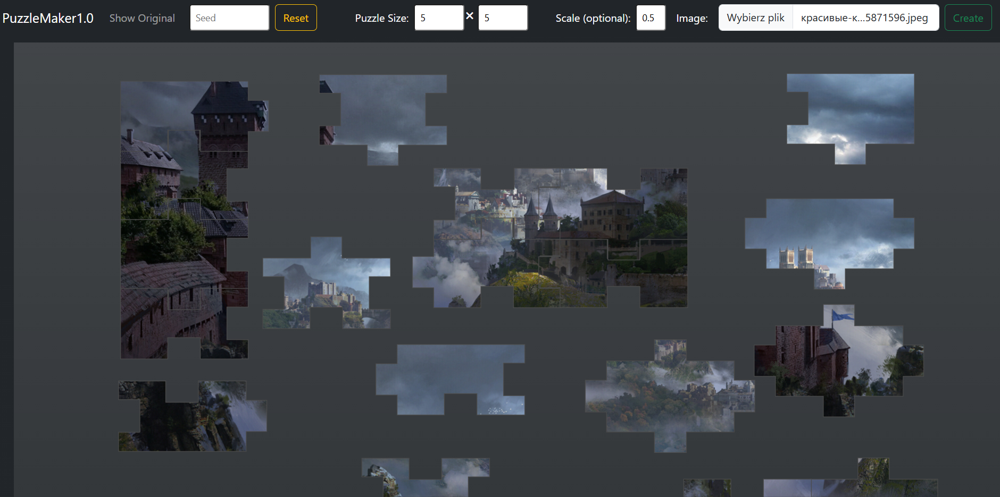
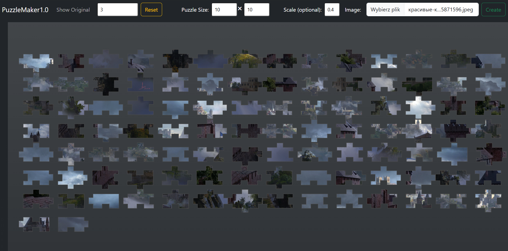
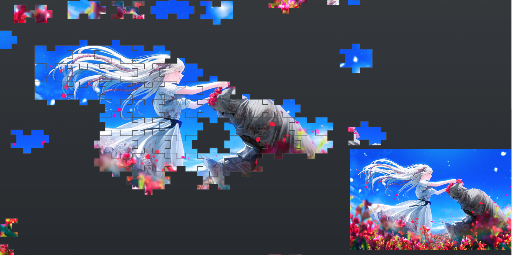

This react application to generate jigsaw puzzles out of provided image.
Frontend written in react and backend in Python. The frontend and backend communicate through a Flask endpoint.

**PuzzleMaker** is an implementation of base React project which written with clean architecture and best practices.

## How to use
1. Make sure you have Python (>=3.11.3) and npm (>=10.5.2) installed
2. Install required dependencies run `npm install` and `pip install -r requirements.txt`
3. Run a backend execute following command from application root folder  
`python -m flask --app .\pythonServer\server.py run`
4. In the project directory run `npm start` to run the app.
5. Open [http://localhost:3000](http://localhost:3000) to view it in your browser.  
The page will reload when you make changes.\
You may also see any lint errors in the console.
6. Enter all required parameters and press 'Create' button
7. Have fun

## Parameters
- Puzzle size: the number of rows and columns into which the image will be splited.
- Scale: number between 0 and 1. Rescale original image by given number.
- Image: image to create puzzle from.
- Seed: defines order in which puzzle pieces will be placed.

## Screenshoots

## Known issues
1. Scaling page after puzzle generation may lead to problems with puzzle piece snapping
